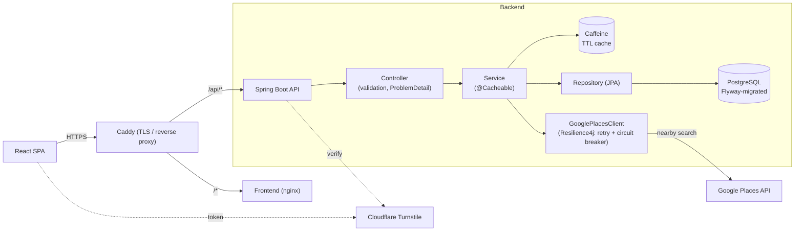

# NearPoint 🚀

Find interesting places near any coordinate. A full-stack app with a **Spring Boot** API
(resilient Google Places integration, PostgreSQL + Caffeine caching, versioned migrations,
OpenAPI, security & rate limiting) and a **React** frontend, containerized end-to-end.

<!-- Replace the badge URLs with your repo / SonarCloud project once connected -->

[](https://sonarcloud.io/summary/new_code?id=YOUR_SONAR_PROJECT_KEY)
[](https://sonarcloud.io/summary/new_code?id=YOUR_SONAR_PROJECT_KEY)


### 🔗 Live demo
- **Frontend:** https://near-point.vercel.app
- **Backend API:** https://nearpoint-production.up.railway.app
- **API docs (Swagger UI):** `/swagger-ui.html`

---

## 🏗️ Architecture



**Request path:** `CorrelationIdFilter` → `RateLimitFilter` (Bucket4j) → Spring Security
(`ApiKeyAuthFilter`) → Controller → Service → (Caffeine → PostgreSQL → Google Places).

---

## ⚙️ Tech stack

| Layer | Tech |
|---|---|
| **Backend** | Java 21, Spring Boot 3.5, Spring Web / Data JPA / Security / Cache / Actuator |
| **Data** | PostgreSQL, Flyway migrations, Caffeine cache |
| **Resilience** | Resilience4j (retry + circuit breaker), bounded RestTemplate timeouts |
| **API** | springdoc-openapi (Swagger UI), RFC 7807 ProblemDetail errors, MapStruct DTOs, Bean Validation |
| **Security** | Optional API-key auth, Bucket4j rate limiting, Cloudflare Turnstile bot protection |
| **Observability** | Micrometer + Prometheus, structured (ECS) JSON logs, correlation IDs (MDC) |
| **Frontend** | React 19, React Bootstrap, Axios, React Router, `@react-google-maps/api` |
| **Testing** | JUnit 5, Testcontainers (real PostgreSQL), WireMock, MockMvc slices, JaCoCo |
| **CI/CD** | GitHub Actions, Jenkins (declarative pipeline), SonarCloud |
| **Delivery** | Multi-stage Docker images, Docker Compose, Caddy (auto-HTTPS) |

---

## ✨ Features

- 🔍 Search nearby places by **latitude / longitude / radius**, rendered on **Google Maps**
- 🗺️ Filter by **rating** and **type**, view details, jump to Google Maps
- 🕘 Client-side **search history**
- ⚡ **Two-level caching** (Caffeine + PostgreSQL) — repeat searches skip the upstream call
- 🛡️ **Resilient** upstream calls — retry + circuit breaker + timeouts, graceful degradation
- 🤖 **Cloudflare Turnstile** bot check + **rate limiting** + optional **API key**
- 📖 Interactive **OpenAPI** docs, consistent **RFC 7807** errors

---

## 🔌 API

Base URL: `http://localhost:8070`

**Find nearby places**
```sh
curl "http://localhost:8070/api/places/nearby?latitude=41.0370&longitude=28.9851&radius=1000"
```

**Validation error (RFC 7807)** — e.g. latitude out of range:
```sh
curl "http://localhost:8070/api/places/nearby?latitude=999&longitude=28.98&radius=1000"
# { "title":"Validation failed", "status":400, "errors":{ "latitude":"latitude must be <= 90" } }
```

**Browse stored places (paginated)**
```sh
curl "http://localhost:8070/api/places?page=0&size=10&sort=rating,desc"
```

**Health / metrics / docs**
```sh
curl http://localhost:8070/actuator/health
curl http://localhost:8070/actuator/prometheus
open http://localhost:8070/swagger-ui.html
```

---

## 🚀 Run locally (Docker — recommended)

```sh
git clone https://github.com/FurkanAksoyy/NearPoint.git
cd NearPoint
cp .env.example .env      # add your Google API keys (see below)
docker compose up -d --build
```
- Frontend → http://localhost:3000
- Backend → http://localhost:8070
- PostgreSQL → localhost:5433

### Run without Docker
```sh
# Backend (needs a local PostgreSQL on 5432, or point env vars at one)
./mvnw spring-boot:run
# Frontend
cd frontend && npm install && npm start
```

### Configuration (env vars)
| Variable | Purpose |
|---|---|
| `GOOGLE_PLACES_API_KEY` | Server key, **Places API** enabled |
| `REACT_APP_GOOGLE_MAPS_API_KEY` | Browser key, **Maps JavaScript API** enabled |
| `SPRING_DATASOURCE_URL/USERNAME/PASSWORD` | Database connection |
| `SPRING_PROFILES_ACTIVE` | `dev` (default) or `prod` (JSON logs) |
| `CORS_ALLOWED_ORIGINS` | Comma-separated allowed origins |
| `TURNSTILE_SECRET_KEY` / `REACT_APP_TURNSTILE_SITE_KEY` | Cloudflare Turnstile (blank = disabled) |
| `API_KEY` | Optional API-key auth (blank = public) |

> Turnstile and API-key auth are **disabled when unconfigured**, so the app runs out of the box.

---

## 🧪 Testing

```sh
./mvnw verify          # unit + slice + Testcontainers ITs, then JaCoCo report
```
- **Unit/slice** (`*Test`, Surefire): `@WebMvcTest` controller, Turnstile logic.
- **Integration** (`*IT`, Failsafe): full context on a real **PostgreSQL (Testcontainers)** with
  **WireMock** standing in for Google Places — verifies fetch → persist → cache and error paths.
- Coverage report: `target/site/jacoco/index.html`.

> Integration tests need a running Docker daemon.

---

## 🔁 CI/CD

- **GitHub Actions** (`.github/workflows/ci.yml`) — build, test (Testcontainers), coverage; optional SonarCloud job.
- **Jenkins** (`Jenkinsfile`) — declarative `Build → Test → Integration Test → SonarQube → Package`.
- **SonarCloud** — set repo secret `SONAR_TOKEN` and variables `SONAR_ORG` / `SONAR_PROJECT_KEY`
  (or edit `sonar-project.properties`), then the analysis + coverage badges above go live.

---

## 🌍 Deployment

Single-VPS deployment with Docker Compose + Caddy (automatic HTTPS) and Cloudflare Tunnel notes:
see **[DEPLOY.md](DEPLOY.md)**.

---

## 📜 License

MIT — see [LICENSE](LICENSE).

🚀 Created by [Furkan Aksoy](https://github.com/FurkanAksoyy)
