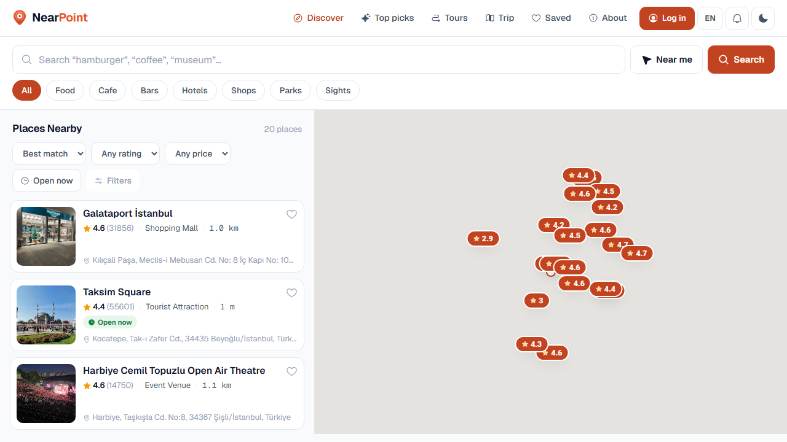
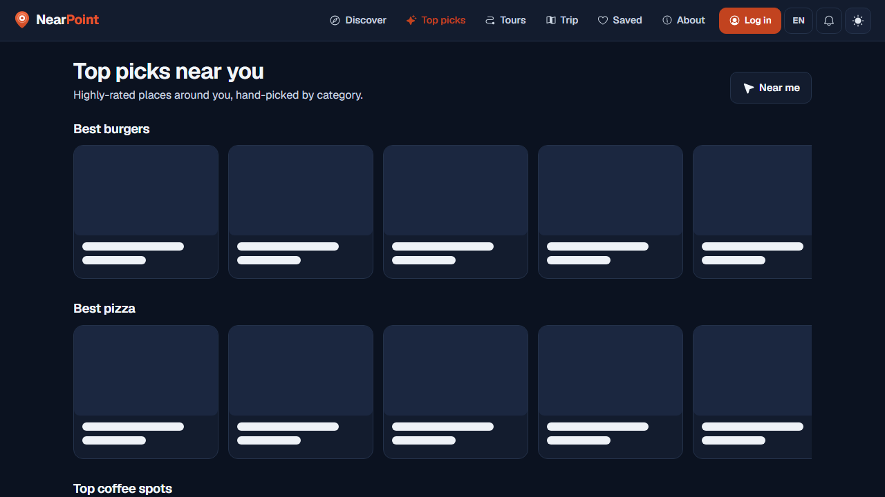
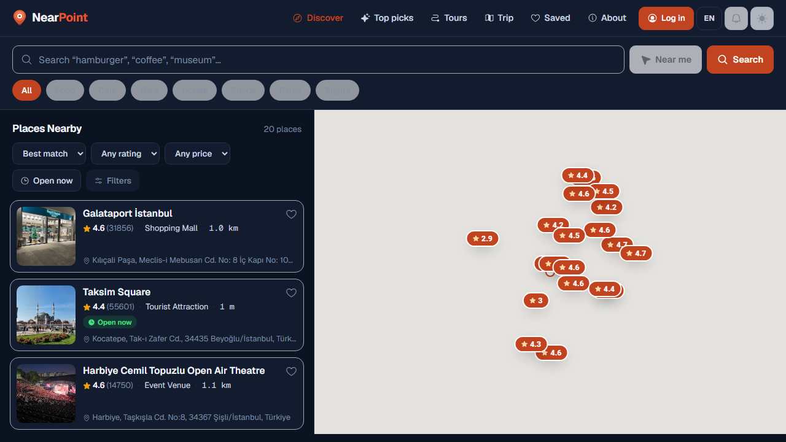
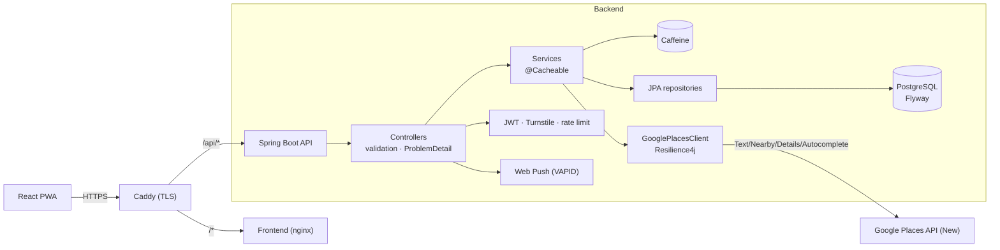

# NearPoint 🚀

Discover great places near you. A full-stack, installable **PWA** with a **Spring Boot** API
and a **React** frontend: keyword search with autocomplete, a synced map + list, curated
picks, walking tours, a trip planner, accounts with cross-device favorites, and web push —
all containerized and CI-tested.


<!-- A SonarCloud quality-gate badge can be added here once a SONAR_TOKEN is configured (see CI). -->

### 🔗 Run it
Self-hosted with Docker Compose + Caddy (auto-HTTPS) — see **[DEPLOY.md](DEPLOY.md)**.
API docs live at `/swagger-ui.html`. Enable Cloudflare Turnstile (`TURNSTILE_*`) in production
so the public `/api/places` endpoints aren't an open, billable Google Places proxy.

---



<p align="center">
  
  
</p>

---

## ✨ Features

**Search & discover**
- 🔎 Keyword search with **search-as-you-type autocomplete** + **recent searches**
- 📍 **“Near me”** geolocation, category chips, and filters (sort, rating, **price**, open-now)
- 🗺️ **Split map + list** on desktop; a draggable **bottom sheet** over the map on mobile
- ⭐ **Top Picks** (best burgers, pizza, coffee…), **history & culture Tours** (routed walk),
  and a **Trip planner** (add stops, optimize a route, open it in Google Maps)
- 🏙️ SEO landing pages: **`/near/:city/:category`** (“Best burgers in Istanbul”)

**Place details**
- 📸 Photos, opening hours, phone, website, **reviews**, **directions**, **share**
- 🎟️ Contextual **Book / Reserve** affiliate links (non-intrusive)

**Personal**
- 👤 **Accounts** (JWT) with **cross-device favorites sync**; guest favorites merge on login
- 💾 **Saved** places, **trip** — persist locally, sync when signed in
- 🔔 **Web push notifications**

**Platform**
- 📱 **Installable PWA** with offline app shell · 🌙 **Dark mode** · 🌍 **TR / EN** i18n
- 🤖 Cloudflare **Turnstile** bot protection · **rate limiting** · optional **API-key** auth
- ♿ Accessible, responsive (dvh/safe-area), and SEO-ready (per-route meta, JSON-LD, sitemap)

---

## 🏗️ Architecture



---

## ⚙️ Tech stack

| Layer | Tech |
|---|---|
| **Backend** | Java 21, Spring Boot 3.5, Web / Data JPA / Security / Cache / Actuator |
| **Data** | PostgreSQL, Flyway, Caffeine cache |
| **Integrations** | Google Places API (New): Text/Nearby/Details/Autocomplete/Photos/Reviews |
| **Resilience/obs** | Resilience4j, Micrometer + Prometheus, structured logs, correlation IDs |
| **Auth/security** | JWT (jjwt) + BCrypt, Cloudflare Turnstile, Bucket4j rate limiting, optional API key |
| **Push** | Web Push (VAPID, web-push + BouncyCastle) |
| **API docs** | springdoc-openapi (Swagger), RFC 7807 ProblemDetail, MapStruct DTOs |
| **Frontend** | React 19, React Bootstrap, vaul (bottom sheet), Google Maps, Geist type, Phosphor icons |
| **Testing** | JUnit 5, Testcontainers, WireMock, JaCoCo; **Playwright** E2E (mobile + desktop) |
| **CI/CD** | GitHub Actions, Jenkins, SonarCloud |
| **Delivery** | Multi-stage Docker, Docker Compose, Caddy (auto-HTTPS), installable PWA |

---

## 🔌 API (selected)

```sh
# Keyword search near a coordinate
curl "http://localhost:8070/api/places/nearby?latitude=41.037&longitude=28.985&radius=2000&query=hamburger"
# Autocomplete · on-demand details · paginated browse
curl "http://localhost:8070/api/places/autocomplete?input=hambur&latitude=41.037&longitude=28.985"
curl "http://localhost:8070/api/places/details/PLACE_ID"
curl "http://localhost:8070/api/places?page=0&size=10&sort=rating,desc"
# Auth + synced favorites
curl -X POST "http://localhost:8070/api/auth/register" -H "Content-Type: application/json" -d '{"email":"you@x.com","password":"secret12345"}'
curl "http://localhost:8070/api/me/favorites" -H "Authorization: Bearer <token>"
# Health / metrics / docs
curl http://localhost:8070/actuator/health
open http://localhost:8070/swagger-ui.html
```

---

## 🚀 Run locally (Docker)

```sh
git clone https://github.com/FurkanAksoyy/NearPoint.git
cd NearPoint
cp .env.example .env          # add Google API keys (see below)
docker compose up -d --build
```
Frontend → http://localhost:3000 · Backend → http://localhost:8070 · Postgres → localhost:5433

### Key configuration (`.env`)
| Variable | Purpose |
|---|---|
| `GOOGLE_PLACES_API_KEY` | Server key, **Places API (New)** enabled |
| `REACT_APP_GOOGLE_MAPS_API_KEY` | Browser key, **Maps JavaScript API** enabled |
| `JWT_SECRET` | Signing secret for accounts (set a strong one in prod) |
| `VAPID_PUBLIC_KEY` / `VAPID_PRIVATE_KEY` | Web push (optional; `npx web-push generate-vapid-keys`) |
| `TURNSTILE_*`, `API_KEY`, `REACT_APP_TURNSTILE_SITE_KEY` | Optional bot/API protection |

> Optional features (Turnstile, API key, push) are **disabled when unconfigured** — the app runs out of the box.

---

## 🧪 Testing

```sh
./mvnw verify                 # backend: unit + slice + Testcontainers ITs + JaCoCo
cd frontend && npx playwright test   # E2E: mobile bottom sheet, dark mode, auth, tours, PWA, autocomplete…
```
- **Backend:** `@WebMvcTest` slices + `@SpringBootTest` ITs on a real **PostgreSQL (Testcontainers)** with **WireMock** for Google.
- **E2E:** Playwright drives real Chromium on mobile + desktop viewports with screenshots.

---

## 🔁 CI/CD & 🌍 Deployment

- **GitHub Actions** builds, runs Testcontainers ITs and coverage; **Jenkinsfile** + **SonarCloud** included.
- Single-VPS deployment with **Docker Compose + Caddy** (automatic HTTPS) and Cloudflare Tunnel notes: see **[DEPLOY.md](DEPLOY.md)**.

## 📜 License

MIT — see [LICENSE](LICENSE). · Created by [Furkan Aksoy](https://github.com/FurkanAksoyy)
